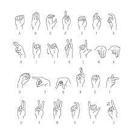
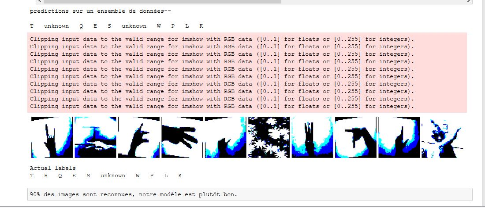

# Language signe détection

Reconnaissance de la langue des signes

Beaucoup de progrès et de recherches en IA ont été faites pour aider les personnes sourdes et muettes. L'apprentissage profond et la vision par ordinateur peuvent également être utilisés pour avoir un impact sur cette cause.

Cela peut être très utile pour les personnes sourdes et muettes dans la communication avec les autres car la connaissance de la langue des signes n'est pas quelque chose qui est commun à tous, de plus, cela peut être étendu à la création des éditeurs automatiques, où la personne peut facilement écrire par ses simples gestes
Objectifs du projet :

    Création du jeu de données (chaque signe est associé à une lettre)
    Entrainez votre modèle sur le jeu de donnée
    Testez votre modèle sur des images afin de construire des mots ou des phrases
    Testez en temps réel avec une Webcam

Notre modèle de reconnaissance est plutôt performant 

